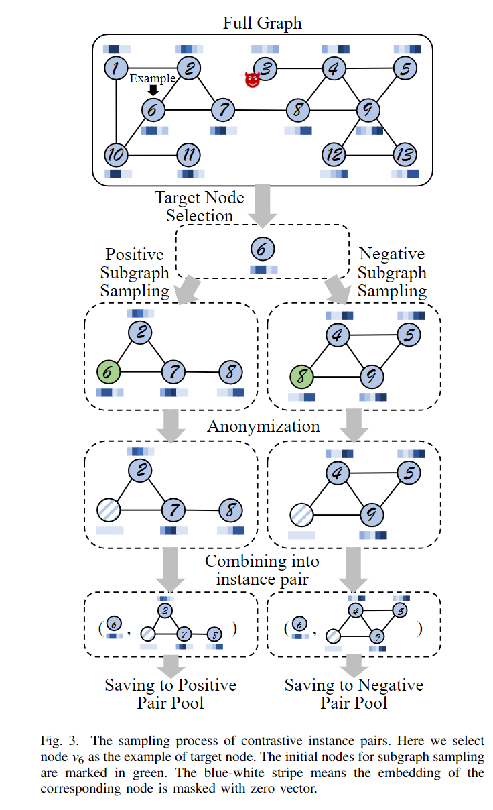
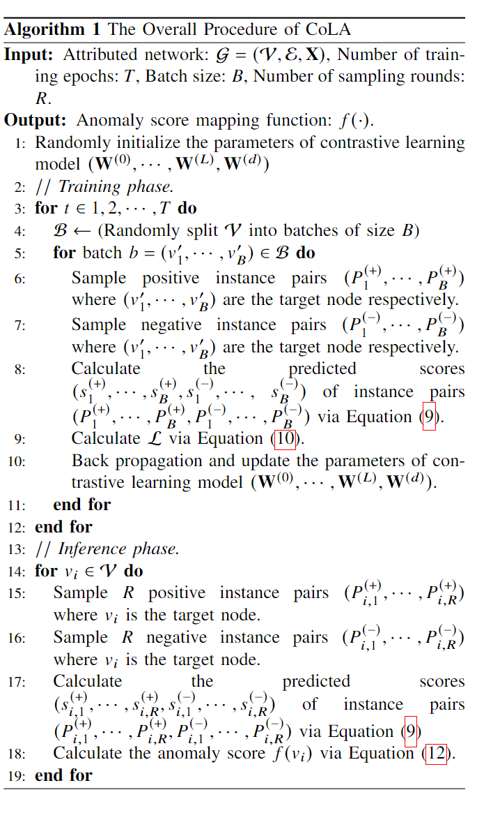

# 通过对比自监督学习在属性网络上进行异常检测(Anomaly Detection on Attributed Networks via Contrastive Self-Supervised Learning)

给后来者：本笔记用来帮助同学们了解DeepWalk论文，**遵循[Mozilla Public License 2.0](https://www.mozilla.org/en-US/MPL/2.0/)协议** ，本部分的 `作者`和 `修改人`信息请保留，后面任何内容请后来者按照认为最合适的方式排布、修改。

* 笔记作者：赵敬业
* 修改人：

## 

对比自监督学习(Contrastive Self-supervised learning)是一种自监督学习方法。通过对比正样本和负样本的表示进行学习。流程似乎是：

定义1 属性网络：属性网络(Attributed networks)是$\mathcal{G}=(\mathcal{V}, \mathcal{E}, \mathbf{X})$，其中$\mathbf{X} \in \mathbb{R}^{n \times f}$是属性矩阵/特征矩阵。另外可以用邻接矩阵A表示节点集和边集，因此特征网络也可以表示为$\mathcal{G}=(\mathbf{A}, \mathbf{X})$。

定义2 属性网络上的异常检测(Anomaly Detection on Attributed networks)。给定属性网络$\mathcal{G}=(\mathcal{V}, \mathcal{E}, \mathbf{X})$，目标是学习每个节点$v_i$的异常评分(anomaly score)$k_i=f\left(v_i\right)$。

本文考虑无监督异常检测。另外符号表如下所示：

| Notation | Explanation |
| :---: | :---: |
| $\begin{array}{c}\mathcal{G}=(\mathcal{V}, \mathcal{E}, \mathbf{X}) \\\mathcal{V} \\\mathcal{E} \\\mathbf{X} \in \mathbb{R}^{n \times f} \\\mathbf{A} \in \mathbb{R}^{n \times n} \\\mathbf{x}_i \in \mathbb{R}^f \\n \\f \\k_i\end{array}$ | $\begin{array}{l}\text { A weighted attributed network } \\\text { The node set of } \mathcal{G} \\\text { The edge set of } \mathcal{G} \\\text { The attribute matrix of } \mathcal{G} \\\text { The adjacency matrix of } \mathcal{G} \\\text { The attribute vector of the } i^{t h} \text { node in } \mathcal{G} \\\text { The number of nodes in } \mathcal{G} \\\text { The dimension of attributes in } \mathcal{G} \\\text { The anomaly score of the } i^{t h} \text { node in } \mathcal{G}\end{array}$ |
| $\begin{array}{c}P_i=\left(v_i, \mathcal{G}_i, y_i\right) \\v_i \\\mathcal{G}_i \\y_i \in\{0,1\} \\\mathbf{A}_i \in \mathbb{R}^{c \times c}\end{array}$ | $\begin{array}{l}\text { A contrastive instance pair with index } i \\\text { The target node of instance pair } P_i \\\text { The local subgraph of instance pair } P_i \\\text { The label of instance pair } P_i \\\text { The adjacency matrix of } G_i\end{array}$ |
| $\begin{array}{c}\mathbf{H}_i^{(\ell)} \in \mathbb{R}^{c \times d^{(\ell)}} \\\mathbf{z}_i^{(\ell)} \in \mathbb{R}^{d^{(\ell)}} \\\mathbf{E}_i \in \mathbb{R}^{c \times d} \\\mathbf{e}_i^{l g} \in \mathbb{R}^d \\\mathbf{e}_i^{t n} \in \mathbb{R}^d \\s_i \\\mathbf{W}^{(\ell)} \in \\\mathbb{R}^{d^{(\ell-1)} \times d^{(\ell)}} \\\mathbf{W}^{(d)} \in \mathbb{R}^{d \times d}\end{array}$ | $\begin{array}{l}\text { The hidden representation matrix of } \mathcal{G}_i \\\text { outputted by the } \ell^{\text {th }} \text { layer of GNN module } \\\text { The hidden representation vector of } v_i \\\text { outputted by the } \ell^{t h} \text { layer of GNN module } \\\text { The embedding matrix of the nodes in } \mathcal{G}_i \\\text { The embedding vector of } \mathcal{G}_i \\\text { The embedding vector of } v_i \\\text { The predicted score of } P_i \\\text { The learnable parameter of the } \ell^{t h} \text { layer } \\\text { of GNN module } \\\text { The learnable parameter of discriminator } \\\text { module }\end{array}$ |
| $\begin{array}{l}R \\c \\d\end{array}$ | $\begin{array}{l}\text { The sampling rounds to calculate anomaly } \\\text { scores } \\\text { The number of nodes within the loca } \\\text { subgraphs } \\\text { The dimension of embedding }\end{array}$ |

## 方法

上图展示的是本文使用的方法，图中节点v3是异常节点，图中展示的过程是在评价v6节点的异常函数$f(v_6)$。评判异常节点大概分三步：

1. 采样。
2. 用GNN模型来学习。(GNN-based Contrastive Learning Model)
3. 给目标节点打分。

### 第一步：采样

图中的实例对就是指图中两个实例，有很多种方法，比如整张图和节点配为一对("full graph v.s. node")，大的子图和节点配成一对("large subgraph v.s. node")。

本文专门为Anomaly detection 设计了采样图中的实例对的方法。其insight在于节点的异常通常与节点本身和其相邻结构之间的关系有关，与全图的信息关系不大，通过设计一种新型的对比实例对来捕捉这种局部信息(random walk哪里不行了？)。本文的实例对是目标节点和本地子图(target node v.s. local subgraph)。如果样本对是正的，则本地子图是以目标节点为原点抽的(就是随机游走走出来的意思吧，目标节点是随机游走的起点？)；如果样本对是负的，则目标节点还是目标节点，但本地子图是从另外一个节点那里抽取出来的。

具体的过程如下图所示： 

具体步骤讲解：

1. 目标节点选择(Target node selection)。在一个epoch中以随即顺序选取目标节点，这和random walk是一样的。
2. 子图抽样(Subgraph sampling)。使用有重启的随机游走(random walk with restart)作为采样方法。也可以采用其他方法。
3. 匿名化(Anonymization)。通过把初始节点的属性向量设为零向量，防止对比学习模型直接从局部子图中识别目标节点的存在。
4. 组合成实例对(Combining into instance pair)。最后一步是将目标节点和相关子图组合成实例对。组合后,正负对分别保存到对应的样本池中。

### 第二步：学习(GNN-based Contrastive Learning Model)

样本对$P_i$可以记为：
$$
P_i=\left(v_i, \mathcal{G}_i, y_i\right),
$$
其中$v_i$是目标节点，其属性向量是$x_{v_i}$，$\mathcal{G}_i$是该样本对中随机采样的子图，记为：
$$
\mathcal{G}_i=\left(\mathbf{A}_i, \mathbf{X}_i\right)
$$
另外$y_i$是样本对的标签：
$$
y_i=\left\{\begin{array}{l}
1, P_i \text { 是正样本 } \\
0, P_i \text { 是负样本}
\end{array}\right. .
$$

本文的模型包括三个部分，分别是：GNN模块，readout模块和鉴别模块discriminator模块

下面分别介绍

* GNN模型。GNN模型用于把邻居子节点之间的信息进行组合。本文使用GCN网络进行聚合：
    $$
    \mathbf{H}_i^{(\ell)}=\phi\left(\widetilde{\mathbf{D}}_i^{-\frac{1}{2}} \widetilde{\mathbf{A}}_i \widetilde{\mathbf{D}}_i^{-\frac{1}{2}} \mathbf{H}_i^{(\ell-1)} \mathbf{W}^{(\ell-1)}\right),
    $$
    其中$\mathbf{H}_i^{(\ell-1)}$和$\mathbf{H}_i^{(\ell)}$分别是$\ell-1$层和$\ell$层的表示。$\widetilde{\mathbf{A}}_i=\mathbf{A}_i+\mathbf{I}$是子图的邻接矩阵；$\widetilde{\mathbf{D}}_i$是度数矩阵，$\mathbf{W}^{(\ell-1)} \in \mathbb{R}^{d^{(\ell-1)} \times d^{(\ell)}}$是权重矩阵，$\phi(\cdot)$是激活函数。另外，最终的表示$H_i^{L}$记为$E_i$

    另外，目标节点也应该嵌入，直接使用和GCN相同的权重矩阵和激活函数：
     $$\mathbf{z}_{i}^{(\ell)}=\phi\left(\mathbf{z}_{i}^{(\ell-1)} \mathbf{W}^{(\ell-1)}\right).$$
     其中$z_i^{\ell-1}$是表示向量，$z_i^{0}$是$x_{vi}$的属性向量。输出是目标节点的嵌入$e_i^{tn}$(tn:target node)

* 统计模块：统计模块是GNN中的一个模块，主要是起一个聚合的作用。这里把上面的表示$E_i$进行聚合，用average pooling聚合成$e_i^{lg}$：
  $$\mathbf{e}_{i}^{l g}=\operatorname{Readout}\left(\mathbf{E}_{i}\right)=\sum_{k=1}^{n_{i}} \frac{\left(\mathbf{E}_{i}\right)_{k}}{n_{i}}$$
  其中$(E_(i))_(k)$是$E_i$的第k行，并且$n_i$是子图$\mathcal{G}_i$的节点数量。

* 鉴别模块(discriminator module):给目标节点和子图相似性打分的模块。输入是$e_i^{tn}$和$e_i^{lg}$，这里使用双线性回归函数+logistic sigmoid function进行评分：
   $$s_{i}=\operatorname{Discriminator}\left(\mathbf{e}_{i}^{\lg }, \mathbf{e}_{i}^{t n}\right)=\sigma\left(\mathbf{e}_{i}^{\lg } \mathbf{W}^{(d)} \mathbf{e}_{i}^{t n^{\top}}\right)$$
   式中$W^{(d)}$是权重矩阵（应该也是学习的）。最后希望输出$s_i$和$y_i$尽量接近，使用交叉熵损失就可以了。

上述几个模块整完以后，损失函数也有了，就可以训练了。

### 第三步：打分(Anomaly Score Computation)

训练完以后，我们的分类器应该可以做到确认这个节点是不是和我们的子图是一个类型的东西。其中正常的节点肯定和相邻节点类似，不正常的大概会和相邻节点不类似。这可以反映在我们分类器的分值上，也就是正常节点和他的正常对分值应该接近1，负累对接近0；非正常节点在两种分值上分的不会那么明显，可能都会接近0.5。综上，定义一个anomaly score：
$$f\left(v_{i}\right)=s_{i}^{(-)}-s_{i}^{(+)}.$$
其中$s_{i}^{(-)}$是节点$v_i$和负样本对的分值，$s_{i}^{(+)}$是和正样本对的分值。

当然了，如果只采样一次就有失偏颇了，因此我们采样R轮，每个节点$v_i$包括R个正样本和R个负样本，分别记做：$(P_(i,1)^((+)),cdots,P_(i,R)^((+)))$和$(P_(i,1)^((-)),cdots,P_(i,R)^((-)))$。这样可以计算出分数：$(s_(i,1)^((+)),cdots,s_(i,R)^((+)),s_(i,1)^((-)),cdots,s_(i,R)^((-)))$，从而计算一个平均anomaly Score:
 $$f\left(v_{i}\right)=\frac{\sum_{r=1}^{R}\left(s_{i, r}^{(-)}-s_{i, r}^{(+)}\right)}{R}$$

### 最终流程

## 复杂性分析

抽样过程复杂性：每个目标节点走出一个长度为c的RWR，网络的平均度数是$\sigma$,此时复杂性是$O(c \delta)$(TODO:关网络的平均读数什么事？)

GNN模型的复杂性：每一个实例对复杂度是$O(c^2)$(TODO?)，总复杂度$O(c^2nR)$

后面的打分函数复杂度很低，因此总复杂度$O(cnR(c+\delta))$

## 实验

### 数据集

* 社交网络：BlogCatalog 和Flickr。分别是这两个网站的网络，包括分享和图片什么的。
* 引用网络：包括Cora,Citeseer,Pibmed,ACM和ogbn-arxiv。

需要手动添加一些anomalies 节点（他们闲的？直接一顿训练，训练完再看谁有问题不就好了？）。

* 结构异常（Structural anonalies injection）:注入异常的结构
* 属性异常（Contextual anomalies injection）:把一些正常节点整成异常的。

### 实验设定

* Baselines:
  * AMEN：一个基于个人网络的分析方法。
  * Radar：一个利用属性信息的残差和网络信息的一致性来检测的方法。
  * DOMINANT:
  * DGI

* 评估指标：ROC-AUC
